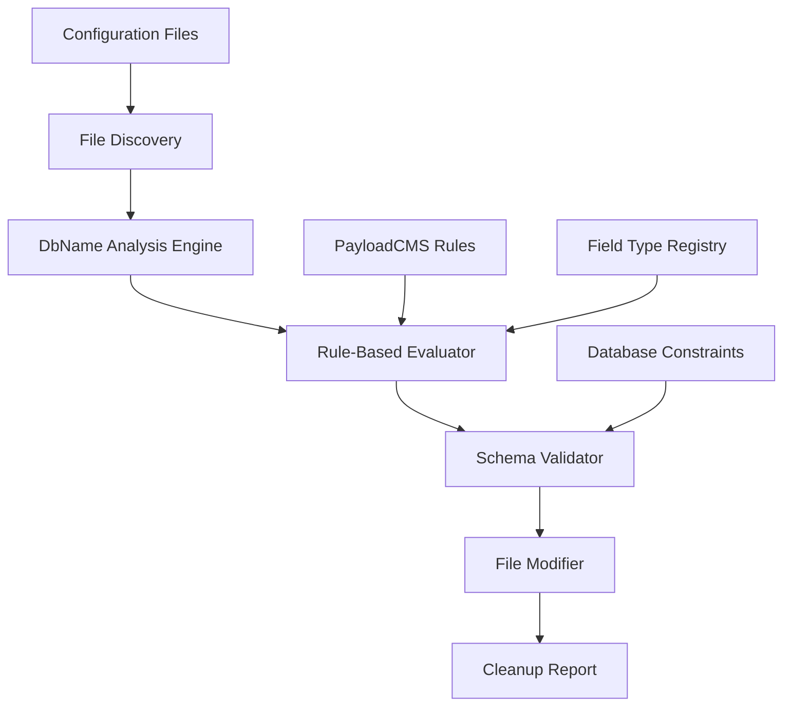

# Design Document

## Overview

The DbName Cleanup Optimization system is designed to systematically analyze and clean up excessive `dbName` usage throughout a PayloadCMS project. The system will identify unnecessary, redundant, and invalid `dbName` properties while preserving strategic usage that solves actual database identifier issues.

The cleanup process follows PayloadCMS best practices and ensures database schema compatibility while reducing configuration complexity and maintenance overhead. The system operates through static analysis of configuration files and applies rule-based cleanup decisions.

## Architecture

The system follows a pipeline architecture with distinct phases:

1. **Discovery Phase**: Scan and catalog all PayloadCMS configuration files
2. **Analysis Phase**: Evaluate each `dbName` usage against cleanup rules
3. **Validation Phase**: Ensure proposed changes maintain database compatibility
4. **Cleanup Phase**: Apply approved modifications to configuration files
5. **Reporting Phase**: Generate comprehensive cleanup analysis



## Components and Interfaces

### ConfigurationScanner

Responsible for discovering and parsing PayloadCMS configuration files.

```typescript
interface ConfigurationScanner {
  scanProject(rootPath: string): Promise<ConfigurationFile[]>
  parseCollectionConfig(filePath: string): Promise<CollectionConfig>
  parseGlobalConfig(filePath: string): Promise<GlobalConfig>
  extractDbNameUsages(config: any): DbNameUsage[]
}

interface ConfigurationFile {
  path: string
  type: 'collection' | 'global' | 'field'
  config: any
  dbNameUsages: DbNameUsage[]
}

interface DbNameUsage {
  location: string // JSON path to the dbName property
  fieldName: string
  dbNameValue: string
  fieldType: string
  nestingLevel: number
  context: FieldContext
}
```

### DbNameAnalyzer

Core analysis engine that evaluates `dbName` usage patterns.

```typescript
interface DbNameAnalyzer {
  analyzeUsage(usage: DbNameUsage): AnalysisResult
  evaluateStrategicValue(usage: DbNameUsage): boolean
  checkFieldTypeSupport(fieldType: string): boolean
  calculateIdentifierLength(usage: DbNameUsage): number
}

interface AnalysisResult {
  action: 'remove' | 'keep' | 'modify'
  reason: string
  riskLevel: 'low' | 'medium' | 'high'
  suggestedValue?: string
}

interface FieldContext {
  parentFields: string[]
  collectionSlug: string
  isNested: boolean
  fullPath: string
}
```

### RuleEngine

Implements cleanup rules based on PayloadCMS best practices.

```typescript
interface RuleEngine {
  applyCollectionRules(usage: DbNameUsage): RuleResult
  applyFieldRules(usage: DbNameUsage): RuleResult
  applyValidationRules(usage: DbNameUsage): RuleResult
  checkFieldTypeCompatibility(fieldType: string): boolean
}

interface RuleResult {
  shouldRemove: boolean
  shouldKeep: boolean
  reason: string
  confidence: number
}
```

### SchemaValidator

Validates that cleanup changes maintain database compatibility.

```typescript
interface SchemaValidator {
  validateIdentifierLength(identifier: string): boolean
  checkForConflicts(changes: CleanupChange[]): ValidationResult
  ensureBackwardCompatibility(change: CleanupChange): boolean
  validateDatabaseConstraints(change: CleanupChange): boolean
}

interface ValidationResult {
  isValid: boolean
  conflicts: string[]
  warnings: string[]
  suggestions: string[]
}

interface CleanupChange {
  filePath: string
  location: string
  action: 'remove' | 'modify'
  oldValue: string
  newValue?: string
  impact: 'low' | 'medium' | 'high'
}
```

### FileModifier

Handles safe modification of configuration files.

```typescript
interface FileModifier {
  applyChanges(changes: CleanupChange[]): Promise<ModificationResult>
  removeDbNameProperty(filePath: string, location: string): Promise<void>
  modifyDbNameValue(filePath: string, location: string, newValue: string): Promise<void>
  preserveFormatting(filePath: string): Promise<void>
}

interface ModificationResult {
  filesModified: number
  propertiesRemoved: number
  propertiesModified: number
  errors: string[]
}
```

## Data Models

### PayloadCMS Field Type Registry

The system maintains knowledge of which PayloadCMS field types support `dbName`:

```typescript
interface FieldTypeInfo {
  name: string
  supportsDbName: boolean
  affectsDatabase: boolean
  canBeNested: boolean
  identifierImpact: 'none' | 'low' | 'medium' | 'high'
}

const FIELD_TYPE_REGISTRY: Record<string, FieldTypeInfo> = {
  text: {
    name: 'text',
    supportsDbName: true,
    affectsDatabase: true,
    canBeNested: true,
    identifierImpact: 'low',
  },
  textarea: {
    name: 'textarea',
    supportsDbName: true,
    affectsDatabase: true,
    canBeNested: true,
    identifierImpact: 'low',
  },
  email: {
    name: 'email',
    supportsDbName: true,
    affectsDatabase: true,
    canBeNested: true,
    identifierImpact: 'low',
  },
  number: {
    name: 'number',
    supportsDbName: true,
    affectsDatabase: true,
    canBeNested: true,
    identifierImpact: 'low',
  },
  date: {
    name: 'date',
    supportsDbName: true,
    affectsDatabase: true,
    canBeNested: true,
    identifierImpact: 'low',
  },
  checkbox: {
    name: 'checkbox',
    supportsDbName: true,
    affectsDatabase: true,
    canBeNested: true,
    identifierImpact: 'low',
  },
  select: {
    name: 'select',
    supportsDbName: true,
    affectsDatabase: true,
    canBeNested: true,
    identifierImpact: 'low',
  },
  relationship: {
    name: 'relationship',
    supportsDbName: true,
    affectsDatabase: true,
    canBeNested: true,
    identifierImpact: 'medium',
  },
  upload: {
    name: 'upload',
    supportsDbName: true,
    affectsDatabase: true,
    canBeNested: true,
    identifierImpact: 'medium',
  },
  richText: {
    name: 'richText',
    supportsDbName: true,
    affectsDatabase: true,
    canBeNested: true,
    identifierImpact: 'low',
  },
  json: {
    name: 'json',
    supportsDbName: true,
    affectsDatabase: true,
    canBeNested: true,
    identifierImpact: 'low',
  },
  point: {
    name: 'point',
    supportsDbName: true,
    affectsDatabase: true,
    canBeNested: true,
    identifierImpact: 'medium',
  },
  array: {
    name: 'array',
    supportsDbName: true,
    affectsDatabase: true,
    canBeNested: true,
    identifierImpact: 'high',
  },
  group: {
    name: 'group',
    supportsDbName: true,
    affectsDatabase: true,
    canBeNested: true,
    identifierImpact: 'high',
  },
  blocks: {
    name: 'blocks',
    supportsDbName: true,
    affectsDatabase: true,
    canBeNested: true,
    identifierImpact: 'high',
  },
  tabs: {
    name: 'tabs',
    supportsDbName: false,
    affectsDatabase: false,
    canBeNested: false,
    identifierImpact: 'none',
  },
  row: {
    name: 'row',
    supportsDbName: false,
    affectsDatabase: false,
    canBeNested: false,
    identifierImpact: 'none',
  },
  collapsible: {
    name: 'collapsible',
    supportsDbName: false,
    affectsDatabase: false,
    canBeNested: false,
    identifierImpact: 'none',
  },
  ui: {
    name: 'ui',
    supportsDbName: false,
    affectsDatabase: false,
    canBeNested: false,
    identifierImpact: 'none',
  },
}
```

### Cleanup Rules Configuration

```typescript
interface CleanupRules {
  collectionLevel: CollectionRule[]
  fieldLevel: FieldRule[]
  validation: ValidationRule[]
}

interface CollectionRule {
  name: string
  condition: (usage: DbNameUsage) => boolean
  action: 'remove' | 'keep'
  reason: string
}

interface FieldRule {
  name: string
  fieldTypes: string[]
  condition: (usage: DbNameUsage) => boolean
  action: 'remove' | 'keep' | 'modify'
  reason: string
}

interface ValidationRule {
  name: string
  check: (usage: DbNameUsage) => boolean
  severity: 'error' | 'warning'
  message: string
}
```

## Correctness Properties

_A property is a characteristic or behavior that should hold true across all valid executions of a system-essentially, a formal statement about what the system should do. Properties serve as the bridge between human-readable specifications and machine-verifiable correctness guarantees._

Now I need to use the prework tool to analyze the acceptance criteria before writing the correctness properties:

<function_calls>
<invoke name="prework">
<parameter name="featureName">dbname-cleanup-optimization

Based on the prework analysis, I'll now convert the acceptance criteria into testable properties:

**Property 1: Collection dbName cleanup**
_For any_ PayloadCMS collection configuration, when the collection has a `dbName` property that equals the collection slug or provides no meaningful database benefit, the system should remove the `dbName` property while preserving only values that solve identifier length issues
**Validates: Requirements 1.1, 1.2, 1.3, 1.4, 1.5**

**Property 2: Field dbName cleanup**  
_For any_ field configuration, when the field has a `dbName` property that equals the field name, is longer than the field name, or exists on simple non-nested fields without strategic value, the system should remove the `dbName` property while ensuring database column names remain valid
**Validates: Requirements 2.1, 2.2, 2.3, 2.4, 2.5**

**Property 3: Strategic dbName preservation**
_For any_ field that is deeply nested, creates long database identifiers, provides meaningful abbreviations, or solves PostgreSQL 63-character limits, the system should preserve the `dbName` property when it provides strategic value based on full identifier path length
**Validates: Requirements 3.1, 3.2, 3.3, 3.4, 3.5**

**Property 4: DbName conflict resolution**
_For any_ configuration files with duplicate `dbName` values or conflicting patterns between related files, the system should resolve conflicts and ensure consistent `dbName` usage patterns following PayloadCMS best practices
**Validates: Requirements 4.1, 4.2, 4.3, 4.5**

**Property 5: Invalid dbName removal**
_For any_ field type that does not support `dbName` according to PayloadCMS documentation, including UI fields and presentational-only fields, the system should remove the `dbName` property and log the removal with explanation
**Validates: Requirements 5.1, 5.2, 5.3, 5.4, 5.5**

**Property 6: Database schema compatibility**
_For any_ proposed `dbName` removal or modification, the system should validate that resulting identifiers don't exceed length limits, check for migration needs, ensure backward compatibility, and provide alternative solutions when conflicts occur
**Validates: Requirements 6.1, 6.2, 6.3, 6.4, 6.5**

**Property 7: Comprehensive change documentation**
_For any_ cleanup operation, the system should generate comprehensive reports documenting all changes, rationale for removals and preservations, conflict resolutions, and before/after comparisons with impact analysis
**Validates: Requirements 4.4, 7.1, 7.2, 7.3, 7.4, 7.5**

**Property 8: PayloadCMS compliance**
_For any_ cleanup decision, the system should reference PayloadCMS official documentation, follow established conventions, ensure preserved properties align with best practices, maintain functionality, and verify final compliance with coding standards
**Validates: Requirements 8.1, 8.2, 8.3, 8.4, 8.5**

**Property 9: In-place file modifications**
_For any_ cleanup operation, the system should modify only existing configuration files in-place without creating backups or new files, output reports to console/logs, and preserve existing file structure and formatting
**Validates: Requirements 9.1, 9.2, 9.3, 9.4, 9.5**

## Error Handling

The system implements comprehensive error handling across all phases:

### File System Errors

- **File Access Issues**: When configuration files cannot be read, the system logs the error and continues with accessible files
- **Permission Errors**: When files cannot be modified, the system reports the issue and suggests manual intervention
- **Backup Failures**: Since no backups are created per requirements, the system validates changes before applying them

### Configuration Parsing Errors

- **Invalid Syntax**: When TypeScript/JavaScript files have syntax errors, the system reports the file and continues
- **Missing Properties**: When expected PayloadCMS properties are missing, the system handles gracefully
- **Type Mismatches**: When `dbName` values are not strings, the system reports and skips the invalid usage

### Validation Errors

- **Identifier Length Violations**: When removing `dbName` would create identifiers exceeding database limits, the system preserves the property and explains why
- **Naming Conflicts**: When multiple fields would have the same database name after cleanup, the system resolves conflicts or reports them for manual resolution
- **Schema Incompatibilities**: When changes would break existing database schema, the system prevents the change and suggests alternatives

### Rule Engine Errors

- **Conflicting Rules**: When multiple rules apply to the same `dbName` usage with different outcomes, the system uses the most conservative approach (preserve rather than remove)
- **Missing Field Type Information**: When encountering unknown field types, the system defaults to preserving `dbName` properties
- **Rule Evaluation Failures**: When rule conditions cannot be evaluated, the system logs the issue and skips the rule

## Testing Strategy

The testing strategy employs both unit testing and property-based testing to ensure comprehensive coverage and correctness.

### Unit Testing Approach

Unit tests focus on specific examples, edge cases, and integration points:

**Configuration Parsing Tests**:

- Test parsing of various PayloadCMS configuration file formats
- Test handling of malformed configuration files
- Test extraction of `dbName` properties from nested structures

**Rule Engine Tests**:

- Test individual cleanup rules with known inputs and expected outputs
- Test rule precedence when multiple rules apply
- Test field type compatibility checking

**File Modification Tests**:

- Test safe modification of TypeScript configuration files
- Test preservation of code formatting and comments
- Test handling of complex nested object structures

**Error Handling Tests**:

- Test graceful handling of file system errors
- Test recovery from parsing failures
- Test validation error reporting

### Property-Based Testing Configuration

Property tests verify universal properties across all inputs using **fast-check** library with minimum 100 iterations per test:

**Property Test 1: Collection DbName Cleanup**

```typescript
// Feature: dbname-cleanup-optimization, Property 1: Collection dbName cleanup
fc.assert(
  fc.property(
    fc.record({
      slug: fc.string(),
      dbName: fc.option(fc.string()),
      // ... other collection properties
    }),
    (collection) => {
      const result = cleanupCollectionDbName(collection)
      // Verify dbName is removed when it equals slug or provides no benefit
      // Verify strategic dbName values are preserved
    },
  ),
  { numRuns: 100 },
)
```

**Property Test 2: Field DbName Cleanup**

```typescript
// Feature: dbname-cleanup-optimization, Property 2: Field dbName cleanup
fc.assert(
  fc.property(
    fc.record({
      name: fc.string(),
      type: fc.constantFrom('text', 'number', 'email', 'relationship'),
      dbName: fc.option(fc.string()),
      // ... other field properties
    }),
    (field) => {
      const result = cleanupFieldDbName(field)
      // Verify redundant dbName properties are removed
      // Verify database column names remain valid
    },
  ),
  { numRuns: 100 },
)
```

**Property Test 3: Strategic DbName Preservation**

```typescript
// Feature: dbname-cleanup-optimization, Property 3: Strategic dbName preservation
fc.assert(
  fc.property(generateNestedFieldStructure(), (nestedField) => {
    const result = evaluateStrategicValue(nestedField)
    // Verify deeply nested fields preserve meaningful dbName
    // Verify identifier length considerations are applied
  }),
  { numRuns: 100 },
)
```

**Property Test 4: DbName Conflict Resolution**

```typescript
// Feature: dbname-cleanup-optimization, Property 4: DbName conflict resolution
fc.assert(
  fc.property(fc.array(generateFieldWithDbName()), (fields) => {
    const result = resolveDbNameConflicts(fields)
    // Verify duplicate dbName values are resolved
    // Verify consistent patterns are applied
  }),
  { numRuns: 100 },
)
```

**Property Test 5: Invalid DbName Removal**

```typescript
// Feature: dbname-cleanup-optimization, Property 5: Invalid dbName removal
fc.assert(
  fc.property(
    fc.record({
      type: fc.constantFrom('ui', 'tabs', 'row', 'collapsible'),
      dbName: fc.string(),
    }),
    (field) => {
      const result = removeInvalidDbName(field)
      // Verify dbName is removed from unsupported field types
      // Verify removal is logged with explanation
    },
  ),
  { numRuns: 100 },
)
```

**Property Test 6: Database Schema Compatibility**

```typescript
// Feature: dbname-cleanup-optimization, Property 6: Database schema compatibility
fc.assert(
  fc.property(generateCleanupChanges(), (changes) => {
    const result = validateSchemaCompatibility(changes)
    // Verify identifier length limits are respected
    // Verify backward compatibility is maintained
  }),
  { numRuns: 100 },
)
```

**Property Test 7: Comprehensive Change Documentation**

```typescript
// Feature: dbname-cleanup-optimization, Property 7: Comprehensive change documentation
fc.assert(
  fc.property(generateCleanupOperation(), (operation) => {
    const result = generateCleanupReport(operation)
    // Verify all changes are documented
    // Verify reports include required sections
  }),
  { numRuns: 100 },
)
```

**Property Test 8: PayloadCMS Compliance**

```typescript
// Feature: dbname-cleanup-optimization, Property 8: PayloadCMS compliance
fc.assert(
  fc.property(generatePayloadConfig(), (config) => {
    const result = ensurePayloadCompliance(config)
    // Verify decisions follow PayloadCMS conventions
    // Verify final state meets coding standards
  }),
  { numRuns: 100 },
)
```

**Property Test 9: In-place File Modifications**

```typescript
// Feature: dbname-cleanup-optimization, Property 9: In-place file modifications
fc.assert(
  fc.property(generateFileSystemState(), (initialState) => {
    const result = performCleanup(initialState)
    // Verify no new files are created
    // Verify file structure and formatting are preserved
  }),
  { numRuns: 100 },
)
```

### Integration Testing

Integration tests verify the complete cleanup pipeline:

- **End-to-End Cleanup**: Test complete cleanup process on sample PayloadCMS projects
- **Multi-File Consistency**: Test cleanup across related configuration files
- **Database Compatibility**: Test that cleaned configurations work with actual PayloadCMS instances
- **Performance Testing**: Test cleanup performance on large codebases with many configuration files

The dual testing approach ensures both specific edge cases are handled correctly (unit tests) and universal properties hold across all possible inputs (property tests), providing comprehensive validation of the cleanup system's correctness and reliability.
