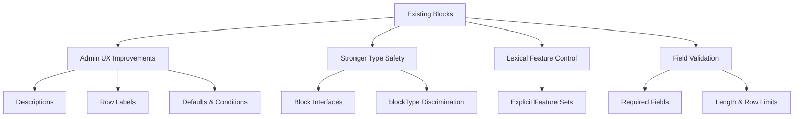

# Design Document

## Overview

This design document describes the **incremental improvement** of the existing Payload CMS blocks implementation to better align with the **quality, consistency, and editor experience standards** demonstrated in official Payload CMS repositories.

This work is a **quality uplift**, not a re-architecture.

All improvements are applied **in place**, preserving:

* existing block behavior
* existing field names and semantics
* existing rendering logic
* backward compatibility

No new architectural layers, runtime systems, or validation frameworks will be introduced.

---

## Architecture

### Current State Analysis

The current blocks implementation is structurally sound but shows common refinement gaps:

* **Admin UX gaps**

  * Missing or inconsistent `admin.description`
  * Missing `RowLabel` for array fields
  * Missing `defaultValue` where sensible
* **Type safety gaps**

  * Some block data relies on implicit typing
  * Inconsistent use of discriminated unions
* **Lexical editor exposure**

  * Some rich text fields expose default editor features
* **Layout block behavior**

  * Some layout-intended blocks behave like content blocks
* **Field validation gaps**

  * Missing `maxLength`, `required`, `minRows`, or `maxRows`

---

### Target Architecture (Conceptual)

The improved system preserves the existing structure while strengthening **four concerns only**:

1. **Admin UX**
2. **Type safety**
3. **Lexical editor control**
4. **Field validation**

These are *concerns*, not new subsystems.



---

## Admin UX Enhancements

Improving editor experience is the **primary goal**.

### Block Descriptions & Labels

Every block configuration should include a clear description explaining **when and why** the block should be used.

```ts
admin: {
  group: 'Hero',
  description:
    'Prominent header sections used at the top of pages to introduce key content.',
}
```

Block labels should be human-readable and consistent.

---

### Row Labels for Array Fields

Array fields should display meaningful labels in the admin UI.

```ts
admin: {
  components: {
    RowLabel: ({ data, index }) =>
      data?.title || data?.heading || `Item ${index + 1}`,
  },
}
```

> No error handling or try/catch logic is required.

---

### Default Values

Fields with a natural default should define one explicitly.

```ts
defaultValue: 'default'
```

This improves speed and reduces editor friction.

---

### Conditional Fields

Conditional fields should use `admin.condition` where applicable.

```ts
admin: {
  condition: (_, siblingData) => siblingData.variant === 'withBackground',
}
```

---

## Type Safety Improvements (Compile-Time Only)

### Block-Specific Interfaces

Each block should define a **TypeScript interface** that reflects its schema.

```ts
export interface HeroBlock {
  blockType: 'hero'
  variant: 'default' | 'centered' | 'split'
  heading: string
  subheading?: string
}
```

---

### Discriminated Unions

Blocks use `blockType` as a discriminator.

```ts
export type PageBlock =
  | HeroBlock
  | ContentBlock
  | CallToActionBlock
  // etc.
```

> **No runtime type guards or validation functions are introduced.**
> Type safety is enforced at compile time only.

---

## Lexical Editor Control

Rich text fields must **explicitly define allowed features**.

### Headings (Restricted)

```ts
editor: lexicalEditor({
  features: ({ defaultFeatures }) => [
    ...defaultFeatures.filter((f) => f.key === 'paragraph'),
  ],
})
```

### Content (Richer)

```ts
editor: lexicalEditor({
  features: ({ defaultFeatures }) => defaultFeatures,
})
```

* No default editor exposure
* No fallback logic
* No try/catch wrappers

Misconfiguration should fail during development, not silently degrade.

---

## Layout Blocks

Layout blocks are treated as **containers**, not content.

Layout blocks:

* may contain nested blocks
* control spacing and width
* do not introduce content fields unrelated to layout

No additional layout system or DSL is introduced.

---

## Field Validation

Validation is handled using **Payload’s native field options only**.

Examples:

* `required: true`
* `maxLength`
* `minRows` / `maxRows`
* constrained `select` options

Custom validation functions are avoided unless absolutely necessary.

---

## Block Categories (Unchanged)

Existing block categories are preserved exactly:

1. Hero
2. Content
3. Services
4. Portfolio
5. Technical
6. CTA
7. Layout

No re-categorization or restructuring is performed.

---

## Correctness Criteria

The refactor is correct if:

1. Every block has a clear admin description
2. Array fields have meaningful row labels
3. TypeScript interfaces reflect actual block schemas
4. `blockType` is used consistently for discrimination
5. Rich text fields define explicit Lexical features
6. Layout blocks behave as containers
7. No runtime validation or fallback logic is introduced
8. Runtime behavior remains unchanged

---

## Explicit Non-Goals

The following are **out of scope**:

* ❌ Runtime validators or type guards
* ❌ Property-based testing
* ❌ Lexical fallback logic
* ❌ New field factory systems
* ❌ New centralized type registries
* ❌ Rewriting rendering logic
* ❌ UI redesigns

---

## Testing Strategy

Testing is intentionally lightweight:

* TypeScript compilation correctness
* Manual admin panel verification
* Existing tests (if any) continue to pass

No new testing frameworks or property-based tests are added.

---

## Summary

This design ensures that the blocks system:

* feels polished and editor-friendly
* matches official Payload quality standards
* remains simple and maintainable
* avoids unnecessary abstraction or infrastructure
* is safe for automated execution via Kiro
