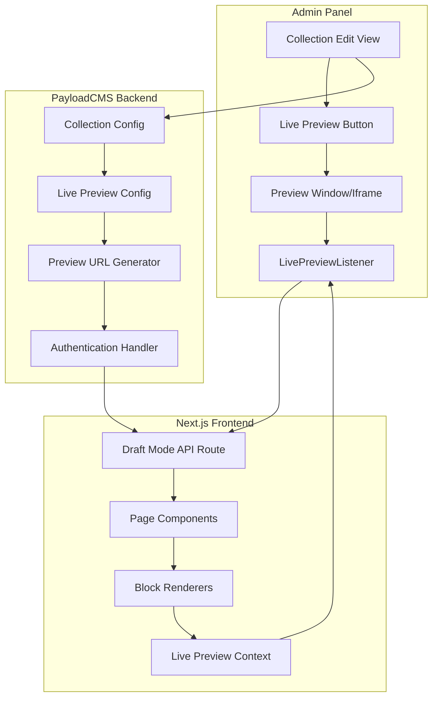

# Design Document

## Overview

The PayloadCMS Live Preview system will provide real-time content updates in the admin panel, enabling content editors to see changes instantly without manual page refreshes. The system integrates with Next.js draft mode, PayloadCMS collections, and the existing block-based content architecture.

The implementation leverages PayloadCMS's built-in live preview capabilities through the `@payloadcms/live-preview-react` package, extending the existing `LivePreviewListener` component and integrating it with the current AdminBar and draft mode system.

## Architecture

### System Components



### Data Flow

1. **Edit Initiation**: User opens a document in the admin panel
2. **Preview Activation**: User clicks the live preview button
3. **URL Generation**: System generates secure preview URL with authentication
4. **Draft Mode Entry**: Frontend enters draft mode via API route
5. **Content Loading**: Page loads with draft content instead of published
6. **Real-time Updates**: Changes in admin panel trigger updates via WebSocket/polling
7. **Content Re-rendering**: Frontend re-renders affected components

### Integration Points

- **PayloadCMS Collections**: All page collections (Pages, BlogPages, ServicesPages, LegalPages, ContactPages)
- **Next.js Draft Mode**: Existing draft mode implementation
- **AdminBar Component**: Current admin bar with preview controls
- **Block System**: Existing block-based content architecture
- **Authentication**: PayloadCMS user authentication system

## Components and Interfaces

### Core Components

#### 1. LivePreviewProvider

```typescript
interface LivePreviewProviderProps {
  children: React.ReactNode
  serverURL: string
  enabled: boolean
}

interface LivePreviewContext {
  isEnabled: boolean
  isLoading: boolean
  lastUpdate: Date | null
  error: string | null
  refresh: () => void
}
```

#### 2. Enhanced LivePreviewListener

```typescript
interface LivePreviewListenerProps {
  serverURL: string
  refresh: () => void
  onUpdate?: (data: any) => void
  onError?: (error: Error) => void
  debounceMs?: number
}
```

#### 3. PreviewModeIndicator

```typescript
interface PreviewModeIndicatorProps {
  isPreview: boolean
  lastUpdate?: Date
  onExit: () => void
  className?: string
}
```

#### 4. Collection Live Preview Config

```typescript
interface LivePreviewConfig {
  url: (doc: any, locale?: string) => string
  collections: string[]
  globals?: string[]
}
```

### API Interfaces

#### 1. Preview API Routes

```typescript
// /api/preview/enter
interface EnterPreviewRequest {
  collection: string
  id: string
  locale?: string
  token: string
}

interface EnterPreviewResponse {
  success: boolean
  previewUrl: string
  error?: string
}

// /api/preview/exit
interface ExitPreviewResponse {
  success: boolean
  redirectUrl: string
}
```

#### 2. Live Preview WebSocket Events

```typescript
interface LivePreviewEvent {
  type: 'document-updated' | 'document-deleted' | 'collection-updated'
  collection: string
  id: string
  data?: any
  timestamp: number
}
```

### Collection Configuration Interface

```typescript
interface CollectionLivePreviewConfig {
  livePreview: {
    url: (doc: any, locale?: string) => string
  }
}
```

## Data Models

### Preview Session Model

```typescript
interface PreviewSession {
  id: string
  userId: string
  collection: string
  documentId: string
  locale?: string
  token: string
  expiresAt: Date
  createdAt: Date
  lastAccessedAt: Date
}
```

### Preview Update Event Model

```typescript
interface PreviewUpdateEvent {
  sessionId: string
  collection: string
  documentId: string
  changeType: 'create' | 'update' | 'delete'
  changedFields: string[]
  data: any
  timestamp: Date
}
```

### Live Preview Configuration Model

```typescript
interface LivePreviewConfiguration {
  enabled: boolean
  collections: {
    [collectionSlug: string]: {
      enabled: boolean
      urlPattern: string
      customPreviewComponent?: string
    }
  }
  debounceMs: number
  maxRetries: number
  retryDelayMs: number
  sessionTimeoutMs: number
}
```

## Error Handling

### Error Types

1. **Authentication Errors**
   - Invalid or expired tokens
   - Insufficient permissions
   - Session timeout

2. **Network Errors**
   - Connection failures
   - Timeout errors
   - Server unavailability

3. **Content Errors**
   - Invalid document IDs
   - Missing collections
   - Malformed data

4. **Configuration Errors**
   - Invalid preview URLs
   - Missing live preview config
   - Unsupported collection types

### Error Recovery Strategies

1. **Automatic Retry**: Exponential backoff for transient failures
2. **Graceful Degradation**: Fall back to manual refresh when live preview fails
3. **User Notification**: Clear error messages with actionable guidance
4. **Logging**: Comprehensive error logging for debugging

### Error Handling Implementation

```typescript
interface ErrorHandler {
  handleAuthError(error: AuthError): void
  handleNetworkError(error: NetworkError): void
  handleContentError(error: ContentError): void
  handleConfigError(error: ConfigError): void
}

class LivePreviewErrorHandler implements ErrorHandler {
  private retryCount = 0
  private maxRetries = 3

  async handleWithRetry<T>(operation: () => Promise<T>, errorType: string): Promise<T> {
    try {
      return await operation()
    } catch (error) {
      if (this.retryCount < this.maxRetries) {
        this.retryCount++
        const delay = Math.pow(2, this.retryCount) * 1000
        await new Promise((resolve) => setTimeout(resolve, delay))
        return this.handleWithRetry(operation, errorType)
      }
      throw error
    }
  }
}
```

## Testing Strategy

### Unit Testing Approach

**Focus Areas:**

- Component rendering and state management
- API route handlers and authentication
- Error handling and recovery mechanisms
- Configuration validation and URL generation

**Testing Tools:**

- Vitest for unit tests
- React Testing Library for component tests
- MSW (Mock Service Worker) for API mocking
- Fast-check for property-based testing

**Unit Test Examples:**

- Preview URL generation with various document types
- Authentication token validation and refresh
- Error boundary behavior with different error types
- Component state updates on preview events

### Property-Based Testing Approach

**Configuration:**

- Minimum 100 iterations per property test
- Each test tagged with feature and property reference
- Comprehensive input generation for edge cases

**Property Test Focus:**

- Universal properties that hold across all collections
- Data consistency during live updates
- Authentication and security properties
- Performance characteristics under load

### Integration Testing

**End-to-End Scenarios:**

- Complete live preview workflow from admin to frontend
- Multi-collection preview switching
- Draft mode integration with authentication
- Real-time update propagation

**Testing Environment:**

- Playwright for E2E testing
- Test database with sample content
- Mock WebSocket server for real-time events
- Performance monitoring and metrics collection

## Correctness Properties

_A property is a characteristic or behavior that should hold true across all valid executions of a system-essentially, a formal statement about what the system should do. Properties serve as the bridge between human-readable specifications and machine-verifiable correctness guarantees._

### Configuration and Setup Properties

**Property 1: Live Preview Configuration Consistency**
_For any_ PayloadCMS configuration with live preview enabled, all specified page collections should have proper live preview configuration applied with valid URL generators and authentication settings.
**Validates: Requirements 1.1, 1.2, 1.5**

**Property 2: Preview URL Generation Completeness**
_For any_ document from any supported collection, the generated preview URL should contain all necessary authentication tokens, draft mode parameters, and collection-specific routing information.
**Validates: Requirements 1.3, 1.4**

### Real-Time Update Properties

**Property 3: Content Update Propagation**
_For any_ content modification in the admin panel, the preview window should reflect the changes within the specified time limit (500ms) and maintain consistency with the modified data.
**Validates: Requirements 2.1, 2.3**

**Property 4: Multi-Collection Preview Support**
_For any_ supported collection type (Pages, BlogPages, ServicesPages, LegalPages, ContactPages), editing a document should provide real-time preview functionality, and switching between different collection documents should update the preview to show the correct content.
**Validates: Requirements 3.1, 3.2, 3.3, 3.4, 3.5, 3.6**

**Property 5: Block Content Update Consistency**
_For any_ block-based content operation (add, remove, modify, reorder), the preview window should immediately reflect the changes, including nested block modifications, while maintaining the correct block structure and order.
**Validates: Requirements 4.1, 4.2, 4.3, 4.4, 4.5**

### Draft Mode and Authentication Properties

**Property 6: Draft Mode Content Serving**
_For any_ preview session, when preview mode is active, the frontend should serve draft content when available, fall back to published content when no draft exists, and return to published content when preview mode is exited.
**Validates: Requirements 5.1, 5.2, 5.3, 5.4**

**Property 7: Authentication and Security Enforcement**
_For any_ preview access attempt, the system should verify user authentication, include secure tokens in preview URLs, handle token expiration gracefully, deny unauthorized access to draft content, and clean up authentication tokens when sessions end.
**Validates: Requirements 7.1, 7.2, 7.3, 7.4, 7.5**

### Performance and Optimization Properties

**Property 8: Update Performance Optimization**
_For any_ sequence of content changes, the system should debounce rapid updates, batch multiple changes for optimal performance, update only changed portions for large content blocks, and respond within specified time limits for cached content.
**Validates: Requirements 6.1, 6.2, 6.3, 6.4**

**Property 9: Error Handling and Recovery**
_For any_ preview operation failure (network issues, authentication failures, invalid URLs, service unavailability), the system should implement appropriate recovery strategies including automatic retry with exponential backoff, graceful degradation, helpful error messages, and fallback to manual refresh when necessary.
**Validates: Requirements 2.5, 6.5, 10.1, 10.2, 10.3, 10.4, 10.5**

### User Experience Properties

**Property 10: Cross-Device Responsive Preview**
_For any_ device type or screen size (mobile, tablet, desktop), the preview window should display appropriately optimized content, adapt to orientation changes, and update layout when responsive breakpoints are crossed.
**Validates: Requirements 9.1, 9.2, 9.3, 9.4, 9.5**

**Property 11: Developer Experience and Debugging**
_For any_ preview operation, the system should provide clear visual indicators when preview mode is active, generate console logging for debugging purposes, display helpful error messages when issues occur, provide clear validation errors for invalid configurations, and offer performance metrics when performance is poor.
**Validates: Requirements 8.1, 8.2, 8.3, 8.4, 8.5**

**Property 12: Concurrent Editing Consistency**
_For any_ scenario where multiple editors work on the same content simultaneously, the preview window should always display the most recent changes and handle concurrent updates without data corruption or inconsistent state.
**Validates: Requirements 2.4**

**Property 13: Authentication Token Lifecycle Management**
_For any_ preview session, authentication tokens should be automatically refreshed before expiration, remain valid throughout the session duration, and be properly cleaned up when sessions end or authentication fails.
**Validates: Requirements 5.5**
