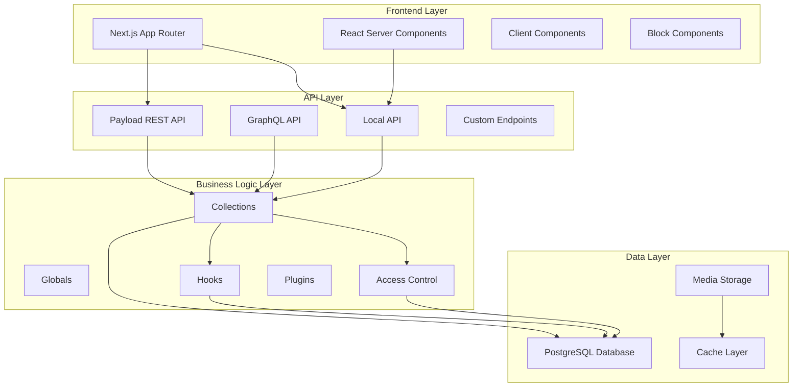
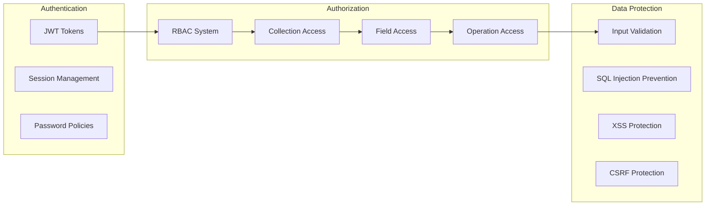

# Design Document: PayloadCMS Project Optimization

## Overview

This design document outlines the comprehensive optimization of the existing PayloadCMS project to align with industry best practices, enhance security, improve performance, and ensure long-term maintainability. The optimization focuses on implementing robust RBAC, transaction-safe operations, performance enhancements, and modern development patterns.

## Architecture

### High-Level Architecture



### Security Architecture



## Components and Interfaces

### Enhanced User Collection with RBAC

```typescript
// src/collections/Users.ts
import type { CollectionConfig } from 'payload'

export const Users: CollectionConfig = {
  slug: 'users',
  auth: true,
  admin: {
    useAsTitle: 'email',
    defaultColumns: ['email', 'roles', 'lastLoginAt', 'createdAt'],
  },
  fields: [
    {
      name: 'firstName',
      type: 'text',
      required: true,
    },
    {
      name: 'lastName',
      type: 'text',
      required: true,
    },
    {
      name: 'roles',
      type: 'select',
      hasMany: true,
      options: [
        { label: 'Super Admin', value: 'super-admin' },
        { label: 'Admin', value: 'admin' },
        { label: 'Editor', value: 'editor' },
        { label: 'Author', value: 'author' },
        { label: 'User', value: 'user' },
      ],
      defaultValue: ['user'],
      required: true,
      saveToJWT: true, // Include in JWT for fast access checks
      access: {
        read: ({ req: { user } }) => {
          // Users can read their own roles, admins can read all
          if (user?.roles?.includes('admin') || user?.roles?.includes('super-admin')) {
            return true
          }
          return { id: { equals: user?.id } }
        },
        update: ({ req: { user } }) => {
          // Only super-admins can modify roles
          return user?.roles?.includes('super-admin') || false
        },
      },
    },
    {
      name: 'lastLoginAt',
      type: 'date',
      admin: {
        readOnly: true,
        position: 'sidebar',
      },
    },
    {
      name: 'loginAttempts',
      type: 'number',
      defaultValue: 0,
      admin: {
        readOnly: true,
        hidden: true,
      },
    },
    {
      name: 'lockUntil',
      type: 'date',
      admin: {
        readOnly: true,
        hidden: true,
      },
    },
  ],
  hooks: {
    beforeLogin: [
      async ({ req }) => {
        // Update last login timestamp
        if (req.user) {
          await req.payload.update({
            collection: 'users',
            id: req.user.id,
            data: { lastLoginAt: new Date() },
            req, // Maintain transaction context
          })
        }
      },
    ],
  },
  access: {
    create: ({ req: { user } }) => {
      // Only admins can create users
      return user?.roles?.some((role) => ['admin', 'super-admin'].includes(role)) || false
    },
    read: ({ req: { user } }) => {
      // Users can read their own profile, admins can read all
      if (user?.roles?.some((role) => ['admin', 'super-admin'].includes(role))) {
        return true
      }
      return { id: { equals: user?.id } }
    },
    update: ({ req: { user } }) => {
      // Users can update their own profile, admins can update all
      if (user?.roles?.some((role) => ['admin', 'super-admin'].includes(role))) {
        return true
      }
      return { id: { equals: user?.id } }
    },
    delete: ({ req: { user } }) => {
      // Only super-admins can delete users
      return user?.roles?.includes('super-admin') || false
    },
  },
}
```

### Enhanced Access Control Functions

```typescript
// src/access/rbac.ts
import type { Access, AccessArgs } from 'payload'
import type { User } from '@/payload-types'

export const createRoleBasedAccess = (allowedRoles: string[]): Access => {
  return ({ req: { user } }: AccessArgs<User>) => {
    if (!user) return false
    return allowedRoles.some((role) => user.roles?.includes(role)) || false
  }
}

export const createOwnerOrRoleAccess = (allowedRoles: string[], ownerField = 'author'): Access => {
  return ({ req: { user } }: AccessArgs<User>) => {
    if (!user) return false

    // Check if user has required role
    if (allowedRoles.some((role) => user.roles?.includes(role))) {
      return true
    }

    // Check if user owns the document
    return { [ownerField]: { equals: user.id } }
  }
}

export const createPublishedOrAuthenticatedAccess = (): Access => {
  return ({ req: { user } }: AccessArgs<User>) => {
    // Authenticated users see all content
    if (user) return true

    // Public users see only published content
    return { _status: { equals: 'published' } }
  }
}

// Specific role-based access functions
export const superAdminOnly = createRoleBasedAccess(['super-admin'])
export const adminOnly = createRoleBasedAccess(['super-admin', 'admin'])
export const editorAccess = createRoleBasedAccess(['super-admin', 'admin', 'editor'])
export const authorAccess = createRoleBasedAccess(['super-admin', 'admin', 'editor', 'author'])
```

### Enhanced Media Collection

```typescript
// src/collections/Media.ts
import type { CollectionConfig } from 'payload'
import path from 'path'
import { fileURLToPath } from 'url'
import { adminOnly, editorAccess } from '@/access/rbac'

const filename = fileURLToPath(import.meta.url)
const dirname = path.dirname(filename)

export const Media: CollectionConfig = {
  slug: 'media',
  folders: true,
  access: {
    create: editorAccess,
    read: () => true, // Public read access for media
    update: editorAccess,
    delete: adminOnly,
  },
  fields: [
    {
      name: 'alt',
      type: 'text',
      required: true,
      admin: {
        description: 'Alt text is required for accessibility compliance',
      },
    },
    {
      name: 'caption',
      type: 'richText',
      editor: lexicalEditor({
        features: ({ rootFeatures }) => [
          ...rootFeatures,
          FixedToolbarFeature(),
          InlineToolbarFeature(),
        ],
      }),
    },
    {
      name: 'focalPoint',
      type: 'point',
      admin: {
        description: 'Click to set the focal point for responsive cropping',
      },
    },
  ],
  upload: {
    staticDir: path.resolve(dirname, '../../public/media'),
    adminThumbnail: 'thumbnail',
    focalPoint: true,
    crop: true,
    formatOptions: {
      format: 'webp',
      options: {
        quality: 85,
      },
    },
    imageSizes: [
      {
        name: 'thumbnail',
        width: 300,
        height: 300,
        position: 'centre',
        formatOptions: {
          format: 'webp',
          options: { quality: 80 },
        },
      },
      {
        name: 'card',
        width: 400,
        height: 300,
        position: 'centre',
        formatOptions: {
          format: 'webp',
          options: { quality: 85 },
        },
      },
      {
        name: 'feature',
        width: 800,
        height: 600,
        position: 'centre',
        formatOptions: {
          format: 'webp',
          options: { quality: 90 },
        },
      },
      {
        name: 'hero',
        width: 1200,
        height: 630,
        position: 'centre',
        formatOptions: {
          format: 'webp',
          options: { quality: 90 },
        },
      },
      {
        name: 'og',
        width: 1200,
        height: 630,
        crop: 'center',
        formatOptions: {
          format: 'jpeg',
          options: { quality: 90 },
        },
      },
    ],
  },
  hooks: {
    beforeChange: [
      ({ data, operation }) => {
        // Auto-generate alt text if not provided (basic implementation)
        if (operation === 'create' && !data.alt && data.filename) {
          data.alt = data.filename.replace(/\.[^/.]+$/, '').replace(/[-_]/g, ' ')
        }
        return data
      },
    ],
  },
}
```

### Transaction-Safe Hooks Implementation

```typescript
// src/hooks/transactionSafe.ts
import type { CollectionAfterChangeHook, CollectionBeforeDeleteHook } from 'payload'

export const createRevalidationHook = (
  getPath: (doc: any) => string,
): CollectionAfterChangeHook => {
  return async ({ doc, previousDoc, req, context }) => {
    // Skip revalidation if disabled via context
    if (context.disableRevalidate) return doc

    try {
      const { revalidatePath } = await import('next/cache')

      // Revalidate current path if published
      if (doc._status === 'published') {
        const path = getPath(doc)
        revalidatePath(path)
        req.payload.logger.info(`Revalidated path: ${path}`)
      }

      // Revalidate old path if unpublished or slug changed
      if (previousDoc?._status === 'published') {
        if (doc._status !== 'published' || doc.slug !== previousDoc.slug) {
          const oldPath = getPath(previousDoc)
          revalidatePath(oldPath)
          req.payload.logger.info(`Revalidated old path: ${oldPath}`)
        }
      }
    } catch (error) {
      req.payload.logger.error(`Revalidation failed: ${error}`)
      // Don't throw - revalidation failure shouldn't break the operation
    }

    return doc
  }
}

export const createCascadingDeleteHook = (
  relatedCollection: string,
  relationField: string,
): CollectionBeforeDeleteHook => {
  return async ({ req, id }) => {
    try {
      // Find and delete related documents
      const relatedDocs = await req.payload.find({
        collection: relatedCollection,
        where: { [relationField]: { equals: id } },
        req, // Maintain transaction context
      })

      // Delete related documents in the same transaction
      for (const relatedDoc of relatedDocs.docs) {
        await req.payload.delete({
          collection: relatedCollection,
          id: relatedDoc.id,
          req, // Critical: maintain transaction context
        })
      }

      req.payload.logger.info(
        `Deleted ${relatedDocs.docs.length} related ${relatedCollection} documents`,
      )
    } catch (error) {
      req.payload.logger.error(`Cascading delete failed: ${error}`)
      throw error // Re-throw to rollback transaction
    }
  }
}
```

### Enhanced Block Components

```typescript
// src/blocks/enhanced/Hero.ts
import type { Block } from 'payload'
import { link } from '@/fields/link'

export const HeroBlock: Block = {
  slug: 'hero',
  interfaceName: 'HeroBlock',
  labels: {
    singular: 'Hero',
    plural: 'Hero Blocks',
  },
  fields: [
    {
      name: 'type',
      type: 'select',
      options: [
        { label: 'Default', value: 'default' },
        { label: 'Centered', value: 'centered' },
        { label: 'Minimal', value: 'minimal' },
        { label: 'Video Background', value: 'video' },
      ],
      defaultValue: 'default',
      required: true,
    },
    {
      name: 'eyebrow',
      type: 'text',
      admin: {
        description: 'Small text above the main heading',
      },
    },
    {
      name: 'heading',
      type: 'text',
      required: true,
      admin: {
        description: 'Main hero heading',
      },
    },
    {
      name: 'subheading',
      type: 'textarea',
      admin: {
        description: 'Supporting text below the heading',
      },
    },
    {
      name: 'media',
      type: 'upload',
      relationTo: 'media',
      admin: {
        condition: (data) => data.type !== 'minimal',
      },
    },
    {
      name: 'videoUrl',
      type: 'text',
      admin: {
        condition: (data) => data.type === 'video',
        description: 'URL for background video (MP4 format recommended)',
      },
    },
    {
      name: 'actions',
      type: 'array',
      maxRows: 3,
      fields: [
        link({
          appearances: ['default', 'secondary', 'outline'],
        }),
      ],
    },
    {
      name: 'settings',
      type: 'group',
      fields: [
        {
          name: 'theme',
          type: 'select',
          options: [
            { label: 'Light', value: 'light' },
            { label: 'Dark', value: 'dark' },
            { label: 'Auto', value: 'auto' },
          ],
          defaultValue: 'auto',
        },
        {
          name: 'height',
          type: 'select',
          options: [
            { label: 'Small (50vh)', value: 'small' },
            { label: 'Medium (75vh)', value: 'medium' },
            { label: 'Large (100vh)', value: 'large' },
          ],
          defaultValue: 'large',
        },
        {
          name: 'enableParallax',
          type: 'checkbox',
          defaultValue: false,
        },
      ],
    },
  ],
}
```

### Performance-Optimized Component Architecture

```typescript
// src/components/blocks/HeroBlock.tsx
import React from 'react'
import Image from 'next/image'
import { CMSLink } from '@/components/Link'
import type { HeroBlock as HeroBlockType } from '@/payload-types'

interface HeroBlockProps {
  block: HeroBlockType
}

export const HeroBlock: React.FC<HeroBlockProps> = ({ block }) => {
  const {
    type = 'default',
    eyebrow,
    heading,
    subheading,
    media,
    videoUrl,
    actions,
    settings,
  } = block

  const themeClass = settings?.theme === 'dark' ? 'dark' : settings?.theme === 'light' ? 'light' : ''
  const heightClass = `h-${settings?.height || 'large'}`

  return (
    <section className={`relative ${heightClass} ${themeClass} overflow-hidden`}>
      {/* Background Media */}
      {type === 'video' && videoUrl ? (
        <video
          autoPlay
          muted
          loop
          playsInline
          className="absolute inset-0 w-full h-full object-cover"
        >
          <source src={videoUrl} type="video/mp4" />
        </video>
      ) : media && typeof media === 'object' ? (
        <Image
          src={media.url || ''}
          alt={media.alt || ''}
          fill
          className={`object-cover ${settings?.enableParallax ? 'parallax' : ''}`}
          priority
          sizes="100vw"
        />
      ) : null}

      {/* Overlay */}
      <div className="absolute inset-0 bg-black/40" />

      {/* Content */}
      <div className="relative z-10 container mx-auto px-4 h-full flex items-center">
        <div className={`max-w-4xl ${type === 'centered' ? 'mx-auto text-center' : ''}`}>
          {eyebrow && (
            <p className="text-sm font-medium text-primary mb-4 uppercase tracking-wider">
              {eyebrow}
            </p>
          )}

          <h1 className="text-4xl md:text-6xl lg:text-7xl font-bold mb-6 text-white">
            {heading}
          </h1>

          {subheading && (
            <p className="text-xl md:text-2xl text-white/80 mb-8 max-w-2xl">
              {subheading}
            </p>
          )}

          {actions && actions.length > 0 && (
            <div className="flex flex-col sm:flex-row gap-4">
              {actions.map((action, index) => (
                <CMSLink
                  key={index}
                  {...action.link}
                  className="px-8 py-4 text-lg rounded-full"
                />
              ))}
            </div>
          )}
        </div>
      </div>
    </section>
  )
}
```

## Data Models

### Enhanced Collection Schemas

```typescript
// src/types/enhanced.ts
export interface EnhancedUser {
  id: string
  email: string
  firstName: string
  lastName: string
  roles: ('super-admin' | 'admin' | 'editor' | 'author' | 'user')[]
  lastLoginAt?: Date
  loginAttempts: number
  lockUntil?: Date
  createdAt: Date
  updatedAt: Date
}

export interface EnhancedMedia {
  id: string
  filename: string
  mimeType: string
  filesize: number
  width?: number
  height?: number
  alt: string
  caption?: any // Rich text content
  focalPoint?: {
    x: number
    y: number
  }
  sizes?: {
    thumbnail?: MediaSize
    card?: MediaSize
    feature?: MediaSize
    hero?: MediaSize
    og?: MediaSize
  }
  url: string
  createdAt: Date
  updatedAt: Date
}

export interface MediaSize {
  url: string
  width: number
  height: number
  mimeType: string
  filesize: number
}
```

## Error Handling

### Comprehensive Error Handling Strategy

```typescript
// src/utilities/errorHandling.ts
import type { PayloadRequest } from 'payload'

export class PayloadError extends Error {
  public statusCode: number
  public code: string

  constructor(message: string, statusCode = 500, code = 'INTERNAL_ERROR') {
    super(message)
    this.statusCode = statusCode
    this.code = code
    this.name = 'PayloadError'
  }
}

export const handleAsyncError = (fn: Function) => {
  return async (...args: any[]) => {
    try {
      return await fn(...args)
    } catch (error) {
      const req = args.find((arg) => arg?.payload) as PayloadRequest

      if (req?.payload?.logger) {
        req.payload.logger.error(`Error in ${fn.name}:`, error)
      }

      // Re-throw with additional context
      if (error instanceof PayloadError) {
        throw error
      }

      throw new PayloadError(`Operation failed: ${error.message}`, 500, 'OPERATION_FAILED')
    }
  }
}

export const createErrorBoundary = (operation: string) => {
  return (target: any, propertyName: string, descriptor: PropertyDescriptor) => {
    const method = descriptor.value
    descriptor.value = handleAsyncError(method)
    return descriptor
  }
}
```

### Global Error Handler

```typescript
// src/hooks/globalErrorHandler.ts
import type { Config } from 'payload'

export const globalErrorHandler: Config['onInit'] = async (payload) => {
  // Set up global error handling
  process.on('unhandledRejection', (reason, promise) => {
    payload.logger.error('Unhandled Rejection at:', promise, 'reason:', reason)
  })

  process.on('uncaughtException', (error) => {
    payload.logger.error('Uncaught Exception:', error)
    process.exit(1)
  })

  // Set up graceful shutdown
  const gracefulShutdown = (signal: string) => {
    payload.logger.info(`Received ${signal}. Shutting down gracefully...`)
    process.exit(0)
  }

  process.on('SIGTERM', () => gracefulShutdown('SIGTERM'))
  process.on('SIGINT', () => gracefulShutdown('SIGINT'))
}
```

## Testing Strategy

### Comprehensive Testing Approach

The testing strategy implements both unit and property-based testing to ensure comprehensive coverage and correctness validation.

#### Unit Testing Framework

```typescript
// tests/unit/access.test.ts
import { describe, it, expect, beforeEach } from 'vitest'
import { createRoleBasedAccess, createOwnerOrRoleAccess } from '@/access/rbac'

describe('RBAC Access Control', () => {
  const mockUser = {
    id: 'user-1',
    roles: ['editor'],
    email: 'test@example.com',
  }

  const mockAdminUser = {
    id: 'admin-1',
    roles: ['admin'],
    email: 'admin@example.com',
  }

  describe('createRoleBasedAccess', () => {
    it('should allow access for users with required roles', () => {
      const editorAccess = createRoleBasedAccess(['editor', 'admin'])
      const result = editorAccess({ req: { user: mockUser } } as any)
      expect(result).toBe(true)
    })

    it('should deny access for users without required roles', () => {
      const adminOnlyAccess = createRoleBasedAccess(['admin'])
      const result = adminOnlyAccess({ req: { user: mockUser } } as any)
      expect(result).toBe(false)
    })

    it('should deny access for unauthenticated users', () => {
      const editorAccess = createRoleBasedAccess(['editor'])
      const result = editorAccess({ req: { user: null } } as any)
      expect(result).toBe(false)
    })
  })

  describe('createOwnerOrRoleAccess', () => {
    it('should allow access for users with required roles', () => {
      const ownerOrAdminAccess = createOwnerOrRoleAccess(['admin'])
      const result = ownerOrAdminAccess({ req: { user: mockAdminUser } } as any)
      expect(result).toBe(true)
    })

    it('should return ownership query for non-privileged users', () => {
      const ownerOrAdminAccess = createOwnerOrRoleAccess(['admin'], 'author')
      const result = ownerOrAdminAccess({ req: { user: mockUser } } as any)
      expect(result).toEqual({ author: { equals: 'user-1' } })
    })
  })
})
```

#### Property-Based Testing Implementation

```typescript
// tests/property/collections.property.test.ts
import { describe, it, expect, beforeAll } from 'vitest'
import { getPayload } from 'payload'
import config from '@/payload.config'
import { faker } from '@faker-js/faker'

describe('Collection Property Tests', () => {
  let payload: any

  beforeAll(async () => {
    payload = await getPayload({ config })
  })

  describe('User Collection Properties', () => {
    it('Property 1: User creation with valid data should always succeed', async () => {
      // Generate random valid user data
      for (let i = 0; i < 100; i++) {
        const userData = {
          email: faker.internet.email(),
          password: faker.internet.password({ length: 12 }),
          firstName: faker.person.firstName(),
          lastName: faker.person.lastName(),
          roles: ['user'],
        }

        const user = await payload.create({
          collection: 'users',
          data: userData,
        })

        expect(user).toBeDefined()
        expect(user.email).toBe(userData.email)
        expect(user.roles).toContain('user')
      }
    })

    it('Property 2: Role-based access should be consistent', async () => {
      // Test that role-based access always behaves consistently
      const testCases = [
        { roles: ['admin'], expectedAccess: true },
        { roles: ['editor'], expectedAccess: true },
        { roles: ['user'], expectedAccess: false },
        { roles: [], expectedAccess: false },
      ]

      for (const testCase of testCases) {
        const mockUser = { roles: testCase.roles }
        const adminAccess = createRoleBasedAccess(['admin', 'editor'])
        const result = adminAccess({ req: { user: mockUser } } as any)
        expect(result).toBe(testCase.expectedAccess)
      }
    })
  })

  describe('Media Collection Properties', () => {
    it('Property 3: Media upload should preserve metadata', async () => {
      // Property: For any valid media upload, metadata should be preserved
      for (let i = 0; i < 50; i++) {
        const mediaData = {
          alt: faker.lorem.sentence(),
          caption: faker.lorem.paragraph(),
        }

        // Simulate file upload (in real test, use actual file)
        const media = await payload.create({
          collection: 'media',
          data: mediaData,
          file: {
            name: faker.system.fileName(),
            data: Buffer.from('fake-image-data'),
            mimetype: 'image/jpeg',
            size: faker.number.int({ min: 1000, max: 1000000 }),
          },
        })

        expect(media.alt).toBe(mediaData.alt)
        expect(media.caption).toBe(mediaData.caption)
        expect(media.url).toBeDefined()
      }
    })
  })
})
```

#### Integration Testing

```typescript
// tests/integration/api.integration.test.ts
import { describe, it, expect, beforeAll, afterAll } from 'vitest'
import { getPayload } from 'payload'
import config from '@/payload.config'

describe('API Integration Tests', () => {
  let payload: any
  let testUser: any

  beforeAll(async () => {
    payload = await getPayload({ config })

    // Create test user
    testUser = await payload.create({
      collection: 'users',
      data: {
        email: 'test@example.com',
        password: 'testpassword123',
        roles: ['editor'],
      },
    })
  })

  afterAll(async () => {
    // Cleanup test data
    if (testUser) {
      await payload.delete({
        collection: 'users',
        id: testUser.id,
      })
    }
  })

  it('should enforce access control in Local API', async () => {
    // Test that Local API respects access control when overrideAccess is false
    const restrictedResult = await payload.find({
      collection: 'users',
      user: testUser,
      overrideAccess: false, // Critical: enforce access control
    })

    // Editor should only see their own user record
    expect(restrictedResult.docs).toHaveLength(1)
    expect(restrictedResult.docs[0].id).toBe(testUser.id)
  })

  it('should handle transaction rollback on error', async () => {
    // Test transaction safety
    const initialCount = await payload.count({ collection: 'pages' })

    try {
      await payload.create({
        collection: 'pages',
        data: {
          title: 'Test Page',
          // Intentionally missing required fields to trigger error
        },
      })
    } catch (error) {
      // Expected to fail
    }

    const finalCount = await payload.count({ collection: 'pages' })
    expect(finalCount.totalDocs).toBe(initialCount.totalDocs)
  })
})
```

Now I need to use the prework tool to analyze the acceptance criteria before writing the correctness properties:

<function_calls>
<invoke name="prework">
<parameter name="featureName">payloadcms-optimization

## Correctness Properties

_A property is a characteristic or behavior that should hold true across all valid executions of a system—essentially, a formal statement about what the system should do. Properties serve as the bridge between human-readable specifications and machine-verifiable correctness guarantees._

Based on the prework analysis, the following correctness properties have been identified to validate the system's behavior across all inputs and scenarios:

### Property 1: RBAC Role Assignment Consistency

_For any_ user creation or update operation, if roles are assigned, then the user's JWT token should contain those exact roles when authenticated.
**Validates: Requirements 1.1, 1.2**

### Property 2: Access Control Enforcement

_For any_ Local API operation with user context, when overrideAccess is set to false, then the operation should respect the user's role-based permissions.
**Validates: Requirements 1.3, 1.4**

### Property 3: Field-Level Access Control

_For any_ document query by a user, sensitive fields should only be visible if the user has the required role permissions for those specific fields.
**Validates: Requirements 1.5**

### Property 4: Transaction Atomicity

_For any_ hook operation that performs nested database operations, if any operation fails, then all related changes should be rolled back completely.
**Validates: Requirements 2.1, 2.3**

### Property 5: Hook Error Handling

_For any_ hook execution that encounters an error, the error should be properly caught and logged without breaking the overall operation flow.
**Validates: Requirements 2.2**

### Property 6: Cache Revalidation Consistency

_For any_ content update that changes published status or slug, the appropriate Next.js cache paths should be revalidated automatically.
**Validates: Requirements 3.1**

### Property 7: Image Size Generation

_For any_ media upload, all configured image size variants should be generated with the correct dimensions and formats.
**Validates: Requirements 3.2, 7.1**

### Property 8: Focal Point Preservation

_For any_ media with a set focal point, cropped image variants should maintain the focal point positioning correctly.
**Validates: Requirements 7.2**

### Property 9: Slug Generation Uniqueness

_For any_ content creation with a title, if no slug is provided, then a unique slug should be auto-generated from the title following URL-safe conventions.
**Validates: Requirements 5.1**

### Property 10: Hierarchical Breadcrumb Generation

_For any_ page with parent relationships, the breadcrumbs array should contain all ancestor pages in the correct hierarchical order.
**Validates: Requirements 5.2**

### Property 11: SEO Metadata Completeness

_For any_ page or content type, the generated metadata should include all required SEO fields (title, description, canonical URL, Open Graph data).
**Validates: Requirements 6.1, 6.2**

### Property 12: Block Component Rendering

_For any_ page with layout blocks, each block type should render its corresponding React component with the correct props and structure.
**Validates: Requirements 8.1**

### Property 13: Form Builder Integration

_For any_ form created through the form builder plugin, the form should render correctly and handle submissions according to its configuration.
**Validates: Requirements 11.1**

### Property 14: GraphQL Query Optimization

_For any_ GraphQL query, the response time should be within acceptable limits and the query should not exceed configured depth limits.
**Validates: Requirements 12.1**

## Implementation Phases

### Phase 1: Security and Access Control (Weeks 1-2)

- Implement enhanced Users collection with RBAC
- Create comprehensive access control functions
- Add field-level access control
- Implement JWT role inclusion
- Add security testing

### Phase 2: Transaction Safety and Error Handling (Week 3)

- Implement transaction-safe hooks
- Add comprehensive error handling
- Create error boundary components
- Add logging and monitoring
- Implement graceful shutdown

### Phase 3: Performance Optimization (Weeks 4-5)

- Enhance Media collection with optimized sizes
- Implement proper Next.js revalidation
- Add caching strategies
- Optimize database queries
- Implement lazy loading

### Phase 4: Content Management Enhancement (Week 6)

- Improve slug generation and validation
- Add hierarchical page relationships
- Implement draft preview functionality
- Enhance rich text editing
- Add content scheduling

### Phase 5: Component Architecture (Week 7)

- Create enhanced block components
- Implement reusable UI components
- Add proper error boundaries
- Optimize server/client component usage
- Add loading states

### Phase 6: Testing and Quality Assurance (Week 8)

- Implement comprehensive unit tests
- Add property-based testing
- Create integration tests
- Add accessibility testing
- Implement performance monitoring

### Phase 7: SEO and Metadata (Week 9)

- Enhance SEO plugin configuration
- Implement dynamic metadata generation
- Add structured data markup
- Create XML sitemap generation
- Add social media optimization

### Phase 8: Final Integration and Deployment (Week 10)

- Integration testing
- Performance optimization
- Security audit
- Documentation updates
- Deployment preparation

## Risk Mitigation

### Technical Risks

- **Database Migration Complexity**: Implement incremental migrations with rollback capabilities
- **Performance Degradation**: Continuous monitoring and performance testing
- **Breaking Changes**: Comprehensive testing and gradual rollout
- **Security Vulnerabilities**: Regular security audits and penetration testing

### Operational Risks

- **Data Loss**: Implement comprehensive backup strategies
- **Downtime**: Blue-green deployment with health checks
- **User Training**: Comprehensive documentation and training materials
- **Rollback Requirements**: Maintain rollback procedures for each phase

## Success Metrics

### Performance Metrics

- Page load time < 2 seconds (95th percentile)
- API response time < 500ms (95th percentile)
- Image optimization reduces file sizes by 60%+
- Cache hit ratio > 80%

### Security Metrics

- Zero unauthorized access incidents
- All security tests passing
- RBAC coverage for 100% of operations
- Audit log completeness > 95%

### Quality Metrics

- Test coverage > 90%
- Zero critical bugs in production
- Property-based tests covering all core functions
- Accessibility compliance (WCAG 2.1 AA)

### User Experience Metrics

- Admin panel response time < 1 second
- Content publishing workflow < 30 seconds
- Zero data loss incidents
- User satisfaction score > 4.5/5
